# Data Structures and Algorithms Essentials

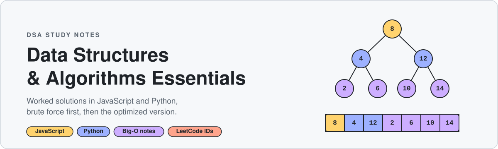

A single place to learn data structures and algorithms by reading and running worked solutions. Problems are grouped by topic and ordered from fundamentals to harder variations. Most files hold more than one approach, usually brute force followed by the optimized solution, with complexity notes in comments.

**152 problems across 12 topics.** Solutions are in Python and JavaScript

More in progress.

## Contents

| Topic | Folder | Problems |
|-------|--------|----------|
| [Sliding Window](#sliding-window) | `1. SlidingWindow/` | 12 |
| [Sorting](#sorting) | `2. Sorting/` | 7 |
| [Linked List](#linked-list) | `3. LinkedList/` | 15 |
| [Two Pointers](#two-pointers) | `4. TwoPointer/` | 4 |
| [Heap / Priority Queue](#heap--priority-queue) | `5. Heap/` | 5 |
| [Recursion & Backtracking](#recursion--backtracking) | `6. Recursion/` | 21 |
| [Trees](#trees) | `7. Trees/` | 27 |
| [Binary Search](#binary-search) | `8. BinarySearch/` | 8 |
| [Graphs](#graphs) | `9. Graph/` | 23 |
| [Dynamic Programming](#dynamic-programming) | `10. DynamicProgramming/` | 19 |

## Suggested learning path

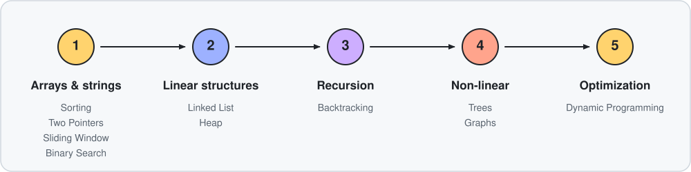

1. **Arrays and strings:** [Sorting](#sorting), [Two Pointers](#two-pointers), [Sliding Window](#sliding-window), [Binary Search](#binary-search)
2. **Linear structures:** [Linked List](#linked-list), [Heap / Priority Queue](#heap--priority-queue)
3. **Recursion:** [Recursion & Backtracking](#recursion--backtracking)
4. **Non-linear structures:** [Trees](#trees), [Graphs](#graphs)
5. **Optimization:** [Dynamic Programming](#dynamic-programming)

## Problems

Numbers in the **LeetCode** column are LeetCode problem IDs. A dash means the problem is a classic or from another source and has no LeetCode ID.

### Sliding Window

Maintain a window `[l, r]` over an array or string and update state incrementally instead of recomputing it. Fixed-size windows come first, then variable-size (grow right, shrink left) windows.

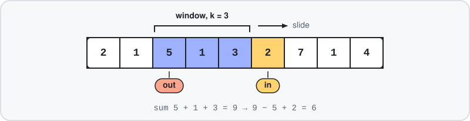

| # | Problem | LeetCode | Technique | Solution |
|---|---------|----------|-----------|----------|
| 1 | Maximum Sum of Distinct Subarrays With Length K | 2461 | Fixed window + set/map | [JS](1.%20SlidingWindow/1.%20MaxSumSubArrayDistinct-2461.js) · [Py](1.%20SlidingWindow/Python/1.%20MaxSumSubArrayDistinct.py) |
| 2 | Maximum Average Subarray I | 643 | Fixed window | [JS](1.%20SlidingWindow/2.%20MaxSubArrAvg-643.js) |
| 3 | Find All Anagrams in a String | 438 | Fixed window + frequency count | [JS](1.%20SlidingWindow/3.%20Anagram-438.js) |
| 4 | Permutation in String | 567 | Fixed window + frequency count | [JS](1.%20SlidingWindow/4.%20PermutationsInString-567.js) |
| 5 | Longest Substring with At Most K Distinct Characters | 340 | Variable window | [JS](1.%20SlidingWindow/5.%20LongestSubStringAtMostKDistinctCh-340.js) |
| 6 | Longest Repeating Character Replacement | 424 | Variable window | [JS](1.%20SlidingWindow/6.%20LongestRepeatingChReplacement-424.js) |
| 7 | Max Consecutive Ones III | 1004 | Variable window | [JS](1.%20SlidingWindow/7.%20MaxConsecutiveOne-III-1004.js) |
| 8 | Minimum Size Subarray Sum | 209 | Variable window (shrink while valid) | [JS](1.%20SlidingWindow/8.%20MinSubArr-209.js) |
| 9 | Shortest Subarray to be Removed to Make Array Sorted | 1574 | Two pointers | [JS](1.%20SlidingWindow/9.%20ShortestSubArrRemoveToSorted-1574.js) |
| 10 | Sliding Window Maximum | 239 | Window + deque | [JS](1.%20SlidingWindow/10.%20SlidingWindowMax-239.js) |
| 11 | Minimum Window Substring | 76 | Variable window + frequency count | [JS](1.%20SlidingWindow/11.%20MinSubString-76.js) |
| 12 | Count Number of Nice Subarrays | 1248 | Window / counting subarrays | [JS](1.%20SlidingWindow/12.%20CountNiceArrays-1248.js) |

### Sorting

The classic sorting algorithms, plus problems that become easy once the input is sorted.

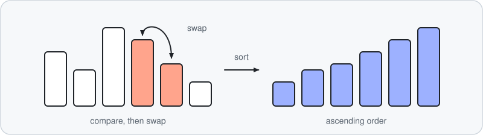

| # | Problem | LeetCode | Technique | Solution |
|---|---------|----------|-----------|----------|
| 1 | Selection, bubble, insertion, merge, quick (out-of-place and in-place) and counting sort | - | Sorting algorithms | [JS](2.%20Sorting/1.%20SortAlgos.js) |
| 2 | Meeting Rooms | 252 | Sort intervals by start | [JS](2.%20Sorting/2.MeetingRoom_1-252.js) |
| 3 | Minimum Platforms | - | Sort arrivals and departures, two pointers | [JS](2.%20Sorting/3.MinPlatform.js) |
| 4 | Dutch National Flag (sort three values) | 75 | Three-way partition | [JS](2.%20Sorting/4.DutchNationalFlag.js) |
| 5 | Intersection of Three Sorted Arrays | 1213 | Pointers over sorted arrays | [JS](2.%20Sorting/5.%20Intersection-1213.js) |
| 6 | Sort Array By Parity | 905 | Partition | [JS](2.%20Sorting/6.%20SortByParity-905.js) |
| 7 | Sort List | 148 | Merge sort on a linked list | [JS](2.%20Sorting/7.%20SortList-148.js) |

### Linked List

Pointer manipulation on singly linked lists. Most files define their own `ListNode`.

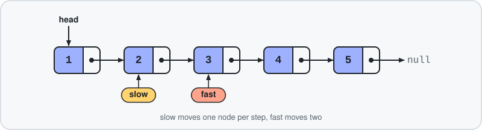

| # | Problem | LeetCode | Technique | Solution |
|---|---------|----------|-----------|----------|
| 1 | Merge Two Sorted Lists | 21 | Dummy head + merge | [JS](3.%20LinkedList/1.%20mergeTwosortedlists-21.js) |
| 2 | Remove Duplicates from Sorted List | 83 | Single pass | [JS](3.%20LinkedList/2.duplicates-83.js) |
| 3 | Remove Linked List Elements | 203 | Dummy head | [JS](3.%20LinkedList/3.remove-203.js) |
| 4 | Reverse Linked List | 206 | Pointer reversal | [JS](3.%20LinkedList/4.%20reverseLL-206.js) |
| 5 | Palindrome Linked List | 234 | Find middle + reverse half | [JS](3.%20LinkedList/5.%20palindrome-234.js) |
| 6 | Remove Nth Node From End of List | 19 | Fast/slow pointers | [JS](3.%20LinkedList/6.%20nthNodeFromList-19.js) |
| 7 | Remove Duplicates from Sorted List II | 82 | Dummy head | [JS](3.%20LinkedList/7.%20duplicates2-82.js) |
| 8 | Delete Node in a Linked List | 237 | Copy next value | [JS](3.%20LinkedList/8.%20delete-237.js) |
| 9 | Delete the Middle Node of a Linked List | 2095 | Fast/slow pointers | [JS](3.%20LinkedList/9.%20deleteMIddle-2095.js) |
| 10 | Middle of the Linked List | 876 | Fast/slow pointers | [JS](3.%20LinkedList/10.%20middle-876.js) |
| 11 | Linked List Cycle II | 142 | Fast/slow pointers (Floyd) | [JS](3.%20LinkedList/11.detectcycle2-142.js) |
| 12 | Merge k Sorted Lists | 23 | Merging | [JS](3.%20LinkedList/14.%20mergeklists.js) |
| 13 | Linked List Random Node | 382 | Array snapshot / random pick | [JS](3.%20LinkedList/16.linkedlistrandom.js) |
| 14 | Convert Sorted List to Binary Search Tree | 109 | Middle as root, recurse | [JS](3.%20LinkedList/17.sortedListBST.js) |
| 15 | Odd Even Linked List | 328 | Two chains, then join | [JS](3.%20LinkedList/88.%20oddEven.js) |

### Two Pointers

Walk two indexes over a (usually sorted) array to avoid a nested loop.

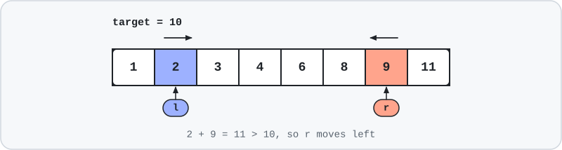

| # | Problem | LeetCode | Technique | Solution |
|---|---------|----------|-----------|----------|
| 1 | K-Sum (generalises 2Sum / 3Sum / 4Sum) | 18 | Sort + recursion + two pointers | [JS](4.%20TwoPointer/1.%20ksum.js) |
| 2 | 3Sum | 15 | Sort + two pointers | [JS](4.%20TwoPointer/2.%20threesum.js) |
| 3 | Remove Duplicates from Sorted Array | 26 | Read/write pointers | [JS](4.%20TwoPointer/3.%20removeDuplicates.js) |
| 4 | Remove Element | 27 | Read/write pointers | [JS](4.%20TwoPointer/4.%20removeElem.js) |

### Heap / Priority Queue

Starts with a hand-written `MinHeap`, then uses it for top-K and streaming problems.

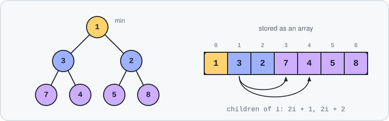

| # | Problem | LeetCode | Technique | Solution |
|---|---------|----------|-----------|----------|
| 1 | `MinHeap` implementation (push, pop, peek, heapify up/down) | - | Data structure | [JS](5.%20Heap/1.%20heap.js) |
| 2 | Kth Largest Element in an Array | 215 | Min-heap of size k | [JS](5.%20Heap/2.%20kthLargestArr-215.js) |
| 3 | Top K Frequent Elements | 347 | Frequency map + heap | [JS](5.%20Heap/3.%20KMostFreqElem-347.js) |
| 4 | Kth Largest Element in a Stream | 703 | Min-heap of size k | [JS](5.%20Heap/4.%20KLargestSTream-703.js) |
| 5 | Find Median from Data Stream | 295 | Two heaps | [JS](5.%20Heap/5.%20OnlineMedian-295.js) |

### Recursion & Backtracking

Recursion basics, subsets/permutations/combinations, and constraint-search problems.

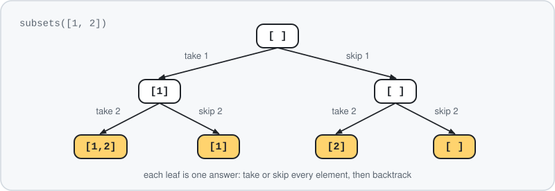

| # | Problem | LeetCode | Technique | Solution |
|---|---------|----------|-----------|----------|
| 1 | Factorial | - | Basic recursion | [JS](6.%20Recursion/0.fact.js) · [Py](6.%20Recursion/Python/1.fact.py) |
| 2 | Reverse a stack | - | Recursion on the call stack | [JS](6.%20Recursion/0.revStack.js) · [Py](6.%20Recursion/Python/2.revStack.py) |
| 3 | Letter Case Permutation | 784 | Backtracking | [JS](6.%20Recursion/1.LetterCasePerm-784.js) · [Py](6.%20Recursion/Python/3.LetterCasePerm-784.py) |
| 4 | Subsets / Subsets II | 78, 90 | Backtracking | [JS](6.%20Recursion/2.Subsets-78-90.js) |
| 5 | Combinations | 77 | Backtracking | [JS](6.%20Recursion/3.Combinations-77.js) |
| 6 | Permutations / Permutations II | 46, 47 | Backtracking | [JS](6.%20Recursion/4.Permute-44-47.js) |
| 7 | Combination Sum I / II | 39, 40 | Backtracking | [JS](6.%20Recursion/5.Combination-sum-I-II%20-39-40.js) |
| 8 | All strings from a pattern with `?` wildcards | - | Backtracking | [JS](6.%20Recursion/6.WildCardPossibilities.js) |
| 9 | Letter Combinations of a Phone Number | 17 | Backtracking | [JS](6.%20Recursion/7.GetWordsFromPhoneNumber-17.js) |
| 10 | 0/1 Knapsack (max profit within capacity) | - | Include / exclude recursion | [JS](6.%20Recursion/8.MaxProfit.js) |
| 11 | Tower of Hanoi | - | Recursion | [JS](6.%20Recursion/9.TowerOfHanoi.js) |
| 12 | Unique Binary Search Trees | 96 | Recursion | [JS](6.%20Recursion/10.NumberOfBST-96.js) |
| 13 | Unique Binary Search Trees II | 95 | Recursion | [JS](6.%20Recursion/11.NumberOfBst-II-95.js) |
| 14 | Rat in a Maze | - | Grid backtracking | [JS](6.%20Recursion/12.RateInAMaze.js) |
| 15 | Palindromic decomposition of a string | 131 | Backtracking | [JS](6.%20Recursion/13.PalidromicDecomp.js) |
| 16 | Check if a subset sums to k | - | Include / exclude recursion | [JS](6.%20Recursion/14.CheckIfsubsetSum.js) |
| 17 | N-Queens | 51 | Backtracking | [JS](6.%20Recursion/20.n-queens-51.js) |
| 18 | Sudoku Solver | 37 | Backtracking | [JS](6.%20Recursion/21.sudoku.js) |
| 19 | Quicksort | - | Divide and conquer | [JS](6.%20Recursion/22.quicksort.js) |
| 20 | Merge sort | - | Divide and conquer | [JS](6.%20Recursion/23.mergesort.js) |
| 21 | Power (x^n) | - | Recursion | [JS](6.%20Recursion/24.power.js) |

### Trees

Binary trees and BSTs: traversals, construction and classic interview problems. Some files use `TreeNode` (`val`), others `BinaryTreeNode` (`value`). Check the header comment in each file.

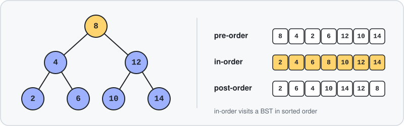

| # | Problem | LeetCode | Technique | Solution |
|---|---------|----------|-----------|----------|
| 1 | BFS traversal (with `shift()` and with a front pointer) | - | Queue | [JS](7.%20Trees/1.%20BFS.js) |
| 2 | Unique Binary Search Trees I / II | 96, 95 | Recursion / DP | [JS](7.%20Trees/1.%20Number%20and%20Values%20of%20BST-96-95.js) |
| 3 | Binary Tree Level Order Traversal | 102 | BFS by level | [JS](7.%20Trees/2.BinaryLevelOrder-102.js) |
| 4 | Binary Tree Level Order Traversal II | 107 | BFS by level | [JS](7.%20Trees/3.BinaryLevel-107.js) |
| 5 | N-ary Tree Level Order Traversal | 429 | BFS by level | [JS](7.%20Trees/4.N-array-429.js) |
| 6 | Binary Tree Right Side View | 199 | BFS by level | [JS](7.%20Trees/5.RightSideView-199.js) |
| 7 | Binary Tree Zigzag Level Order Traversal | 103 | BFS by level | [JS](7.%20Trees/6.Zigzag-103.js) |
| 8 | Reverse (bottom-up) BFS | - | BFS | [JS](7.%20Trees/7.%20RevBFS.js) |
| 9 | Path Sum I / II | 112, 113 | DFS | [JS](7.%20Trees/8.AllpathsAndSum-112%2C113.js) · [Py](7.%20Trees/8.pathSum.py) |
| 10 | Maximum Depth of Binary Tree | 104 | DFS | [JS](7.%20Trees/9.HeightOfTree-104.js) |
| 11 | Pre-order, in-order, post-order (recursive and iterative) | - | DFS | [JS](7.%20Trees/10.DFS.js) · [Py](7.%20Trees/10.DFS.py) |
| 12 | Validate Binary Search Tree | 98 | DFS with bounds | [JS](7.%20Trees/11.ValidBst-98.js) |
| 13 | Diameter of Binary Tree | 543 | DFS, return height | [JS](7.%20Trees/12.Diameter-543.js) · [Py](7.%20Trees/12.Diameter.py) |
| 14 | Lowest Common Ancestor of a Binary Tree | 236 | DFS | [JS](7.%20Trees/13.LCA-236.js) · [Py](7.%20Trees/13.Lca.py) |
| 15 | Binary Search Tree Iterator | 173 | Iterative in-order | [JS](7.%20Trees/14.InOrderBinaryTreeIterator-173.js) |
| 16 | Invert Binary Tree | 226 | DFS / BFS | [JS](7.%20Trees/15.MirrorImage-226-InvertBinaryTree.js) |
| 17 | Clone a binary tree (pre/in/post-order variants) | - | DFS | [JS](7.%20Trees/16.CloneTree.js) |
| 18 | Univalued Binary Tree | 965 | DFS | [JS](7.%20Trees/17.UnivalTree-965.js) |
| 19 | Populate next-right pointers | 116, 117 | BFS / DFS | [JS](7.%20Trees/18.Populatesiblingspointer.js) |
| 20 | Construct BST from Preorder Traversal | 1008 | Recursion with bounds | [JS](7.%20Trees/19.buildBSTFromPreorder-1008.js) |
| 21 | Convert Sorted List to BST | 109 | Recursion | [JS](7.%20Trees/20.sortedListToBST-109.js) |
| 22 | Merge two BSTs | - | In-order arrays + merge | [JS](7.%20Trees/21.%20Merge2BST.js) |
| 23 | Flip a binary tree | - | Recursion | [JS](7.%20Trees/21.flip.js) |
| 24 | Largest BST inside a binary tree | - | DFS, return subtree info | [JS](7.%20Trees/22.%20FindLargestBST.js) |
| 25 | Construct tree from inorder + preorder | 105 | Recursion + index map | [JS](7.%20Trees/23.%20ConstructBinaryTree.js) |
| 26 | Binary tree to doubly linked list | - | In-order DFS | [JS](7.%20Trees/24.BT_DoubleLL.js) |
| 27 | Delete Node in a BST | 450 | BST recursion | [JS](7.%20Trees/25.DeleteFromBST.js) |

### Binary Search

Binary search on sorted, rotated and implicit search spaces. This is the only folder with a `package.json`.

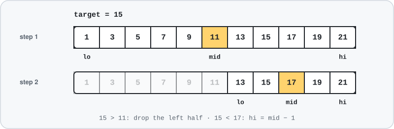

| # | Problem | LeetCode | Technique | Solution |
|---|---------|----------|-----------|----------|
| 1 | Number of Subarrays with Bounded Maximum | 795 | Linear scan (not binary search) | [JS](8.%20BinarySearch/1.maxSubArray.js) |
| 2 | Find K-th Smallest Pair Distance | 719 | Binary search on answer + `heap-js` | [JS](8.%20BinarySearch/2.kth-smallest-pair.js) |
| 3 | Find First and Last Position of Element in Sorted Array | 34 | Lower / upper bound | [JS](8.%20BinarySearch/3.firstAndLastElemSortedArray.js) |
| 4 | Find Minimum in Rotated Sorted Array | 153 | Rotated array | [JS](8.%20BinarySearch/4.minSortedRotatedArr.js) |
| 5 | Search a 2D Matrix | 74 | Binary search on flattened matrix | [JS](8.%20BinarySearch/5.search2DMatrix.js) |
| 6 | Single Element in a Sorted Array | 540 | Binary search on index parity | [JS](8.%20BinarySearch/6.SingleElemSortedArr.js) |
| 7 | Rotation count of a sorted array | - | Rotated array | [JS](8.%20BinarySearch/7.rotationCountSortedArray.js) |
| 8 | Search in Rotated Sorted Array | 33 | Rotated array | [JS](8.%20BinarySearch/8.rotatedArrayTgt.js) |

### Graphs

Traversals, cycle detection, topological sort, grid-as-graph problems and shortest paths.

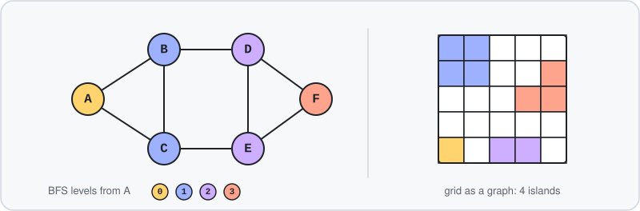

| # | Problem | LeetCode | Technique | Solution |
|---|---------|----------|-----------|----------|
| 1 | DFS traversal | - | DFS | [JS](9.%20Graph/1.DFS.js) |
| 2 | BFS traversal (single and disconnected graphs) | - | BFS | [JS](9.%20Graph/2.BFS.js) |
| 3 | Cycle detection in an undirected graph | - | DFS / BFS | [JS](9.%20Graph/3.CycleUndirected.js) |
| 4 | Cycle detection in a directed graph | - | DFS with recursion stack | [JS](9.%20Graph/4.CycleDirected.js) |
| 5 | Count connected components | 323 | DFS / BFS | [JS](9.%20Graph/5.CountComponents.js) |
| 6 | Is the graph a tree? | 261 | Connectivity + cycle check | [JS](9.%20Graph/6.IsitTree.js) |
| 7 | Is Graph Bipartite? | 785 | Graph colouring | [JS](9.%20Graph/7.Bipartite-785.js) |
| 8 | Rotting Oranges | 994 | Multi-source BFS | [JS](9.%20Graph/8.RottenOrange-994.js) |
| 9 | Number of Islands | 200 | Grid DFS / BFS | [JS](9.%20Graph/9.NumberIslands-200.js) |
| 10 | Max Area of Island | 695 | Grid DFS / BFS | [JS](9.%20Graph/10.LargestIslandSize-695.js) |
| 11 | Snakes and Ladders | 909 | BFS | [JS](9.%20Graph/11.SnakeLadderMInThrows-909.js) |
| 12 | Course Schedule | 207 | Topological sort | [JS](9.%20Graph/12.Courses-207.js) |
| 13 | Course Schedule II | 210 | Topological sort | [JS](9.%20Graph/13.Course2-210.js) |
| 14 | Flood Fill | 733 | Grid DFS / BFS | [JS](9.%20Graph/14.GrayScale-733.js) |
| 15 | Minimum knight moves | - | BFS (recursive version too) | [JS](9.%20Graph/15.KnighshortestPath.js) |
| 16 | Number of Provinces | 547 | DFS / BFS | [JS](9.%20Graph/16.provinces-547.js) |
| 17 | Zombie clusters | - | DFS / BFS on adjacency matrix | [JS](9.%20Graph/16.zombie.js) |
| 18 | Find basins in a matrix | - | Grid DFS | [JS](9.%20Graph/17.CountBasin.js) |
| 19 | Shortest distance to a guard | 286 | Multi-source BFS | [JS](9.%20Graph/18.ShortestDistanceToAGuard-286.js) |
| 20 | String transformation (word ladder style) | 127 | BFS with one-edit check | [JS](9.%20Graph/19.StringTransformation.js) |
| 21 | Critical Connections in a Network | 1192 | Tarjan (discovery / low-link) | [JS](9.%20Graph/20.CriticalConnections.js) |
| 22 | Shortest path on a grid with keys and doors | - | BFS with state | [JS](9.%20Graph/21.%20ShortestPathLandWaterKeyDoor.js) |
| 23 | Longest path in a weighted DAG | - | Topological order + DP | [JS](9.%20Graph/22.LongestPathDAG.js) |

### Dynamic Programming

Recursion first, then memoisation and tabulation. Roughly ordered from 1-D to 2-D and interval DP.

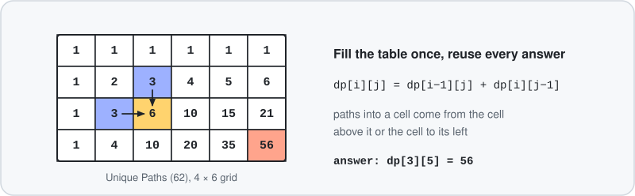

| # | Problem | LeetCode | Technique | Solution |
|---|---------|----------|-----------|----------|
| 1 | Fibonacci | 509 | Memoisation / tabulation | [JS](10.%20DynamicProgramming/1.Fib.js) |
| 2 | Climbing Stairs | 70 | 1-D DP | [JS](10.%20DynamicProgramming/2.Climb-70.js) |
| 3 | Coin Change | 322 | Unbounded knapsack | [JS](10.%20DynamicProgramming/3.CoinChange-322.js) |
| 4 | Coin Change II | 518 | Unbounded knapsack (count ways) | [JS](10.%20DynamicProgramming/4.CoinChange2-518.js) |
| 5 | Edit Distance | 72 | 2-D DP on two strings | [JS](10.%20DynamicProgramming/5.editDistance-72.js) |
| 6 | Rod cutting | - | Unbounded knapsack | [JS](10.%20DynamicProgramming/6.cutRod.js) |
| 7 | Partition Equal Subset Sum | 416 | 0/1 knapsack | [JS](10.%20DynamicProgramming/7.partitionEqualSubsetSum-416.js) |
| 8 | Unique Binary Search Trees | 96 | 1-D DP (Catalan) | [JS](10.%20DynamicProgramming/8.NumberOfBst-96.js) |
| 9 | Jump Game | 55 | DP / greedy | [JS](10.%20DynamicProgramming/9.JumpGame-55.js) |
| 10 | Predict the Winner | 486 | Game DP | [JS](10.%20DynamicProgramming/10.PredictTheWinner-486.js) |
| 11 | Longest increasing subsequence | 300 | Include / exclude to DP | [JS](10.%20DynamicProgramming/11.LongestSubsequence.js) |
| 12 | Word Break | 139 | 1-D DP | [JS](10.%20DynamicProgramming/12.WordBreak.js) |
| 13 | nCr (plain, top-down, bottom-up) | - | Pascal's triangle DP | [JS](10.%20DynamicProgramming/13.nCr.js) |
| 14 | Largest square sub-matrix of 1s | 221 | 2-D DP | [JS](10.%20DynamicProgramming/14.LargestSubmtrix-221.js) |
| 15 | Balanced line breaks (word wrap) | - | DP over line breaks | [JS](10.%20DynamicProgramming/15.WordWrap.js) |
| 16 | String interleaving | 97 | 2-D DP | [JS](10.%20DynamicProgramming/16.StringInerleave.js) |
| 17 | Matrix chain multiplication | - | Interval DP | [JS](10.%20DynamicProgramming/17.MatrixChainMultipication.js) |
| 18 | Unique Paths | 62 | 2-D grid DP | [JS](10.%20DynamicProgramming/18.Uniquepath-62.js) |
| 19 | Maximum path sum in a grid | - | 2-D grid DP | [JS](10.%20DynamicProgramming/19.%20MaxPathSum.js) |
